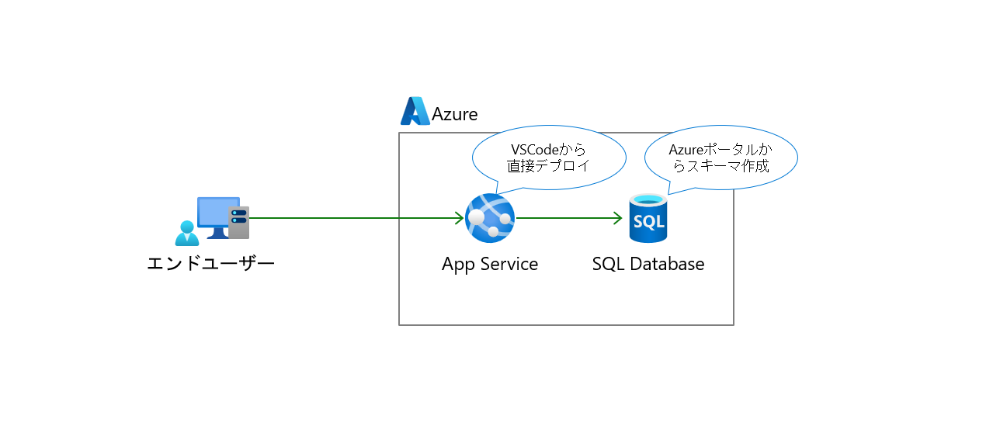

# Azure Study Hands-On

## 目次

### 事前準備

1. [事前準備](preparation01.md)

### ハンズオン

1. [SQL Database 作成](exercise01.md)
1. [SQL Database スキーマ作成](exercise02.md)
1. [App Service 作成](exercise03.md)
1. [App Service へアプリのデプロイ](exercise04.md)
1. [環境削除](exercise99.md)
