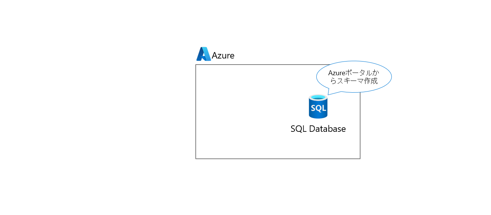
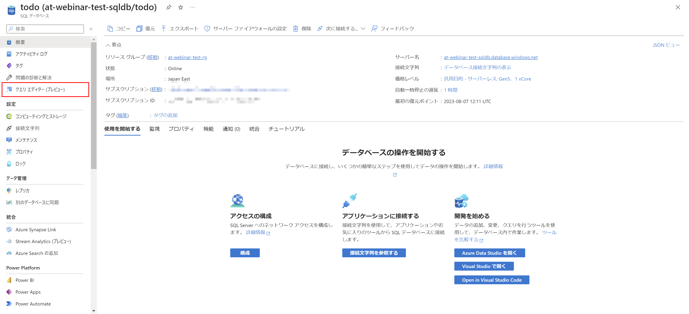
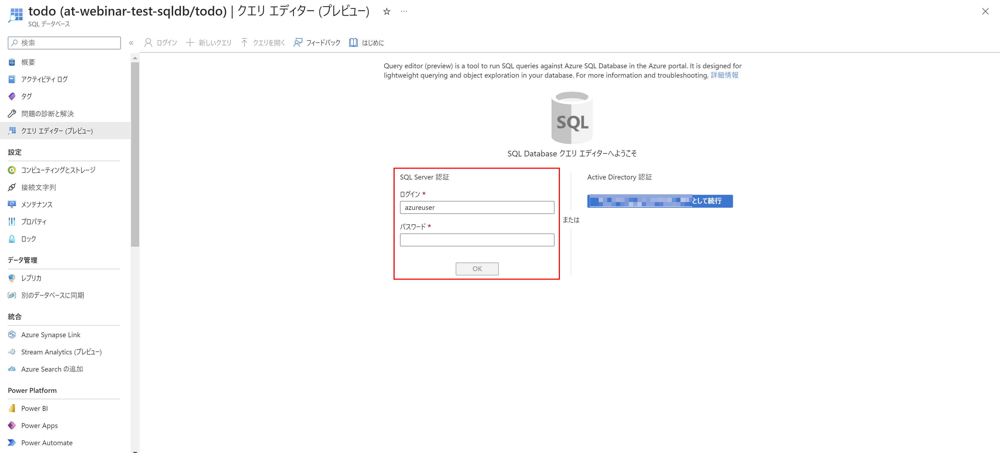
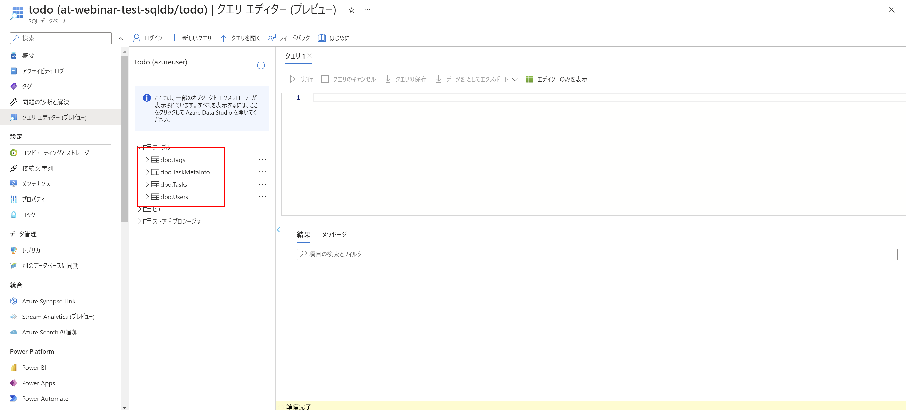
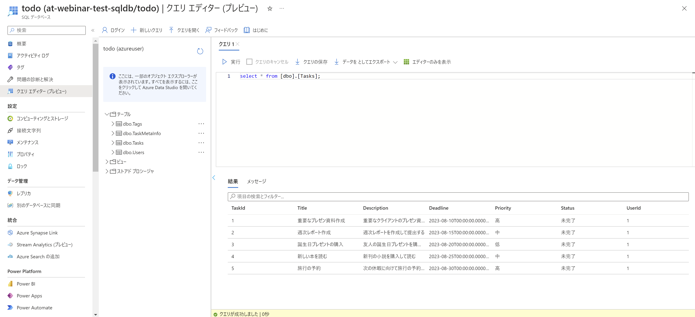

# Exercise2: SQL Database スキーマ作成

## 【目次】



1. [SQL Database スキーマ作成](#sql-database-スキーマ作成)


## SQL Database スキーマ作成

1.  Azureポータル上で作成済のSQLデータベースを開く

1. 「クエリエディター」を開く

    

1. 作成した SQL認証 の ユーザーID/パスワード を入力して「OK」

    

1. 以下にのSQLを実行してスキーマおよびサンプルデータを作成

    * スキーマ作成

        https://raw.githubusercontent.com/akinaritsugo/sample-todo-webapp-csharp/main/data/ddl.sql
    
    * サンプルデータ投入

        https://raw.githubusercontent.com/akinaritsugo/sample-todo-webapp-csharp/main/data/sampledata.sql

1. 「テーブル」を開き、テーブルが作成されていることを確認

    

1. 必要に応じてサンプルデータを確認

    ```
    select * from [dbo].[Tasks];
    ```

    


# 次の Exercise へ

* [App Service 作成](exercise03.md)
