# Exercise4: App Service へアプリのデプロイ

## 【目次】

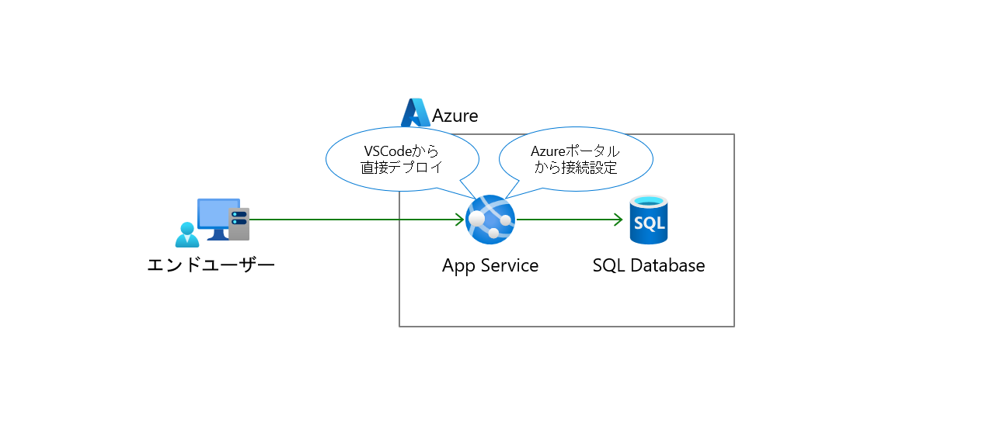


1. [アプリケーションのクローン](#アプリケーションのクローン)
1. [アプリケーションのデプロイ](#アプリケーションのデプロイ)
1. [App Service の設定](#app-service-の設定)
1. [アプリケーションの動作確認](#アプリケーションの動作確認)
1. [SQL Database へデータ登録されたことを確認](#sql-database-へデータ登録されたことを確認)

## アプリケーションのクローン

(*) 開発環境上で実施

1. Visual Studio Code を開き、以下のレポジトリをクローン

    https://github.com/akinaritsugo/sample-todo-webapp-csharp.git

    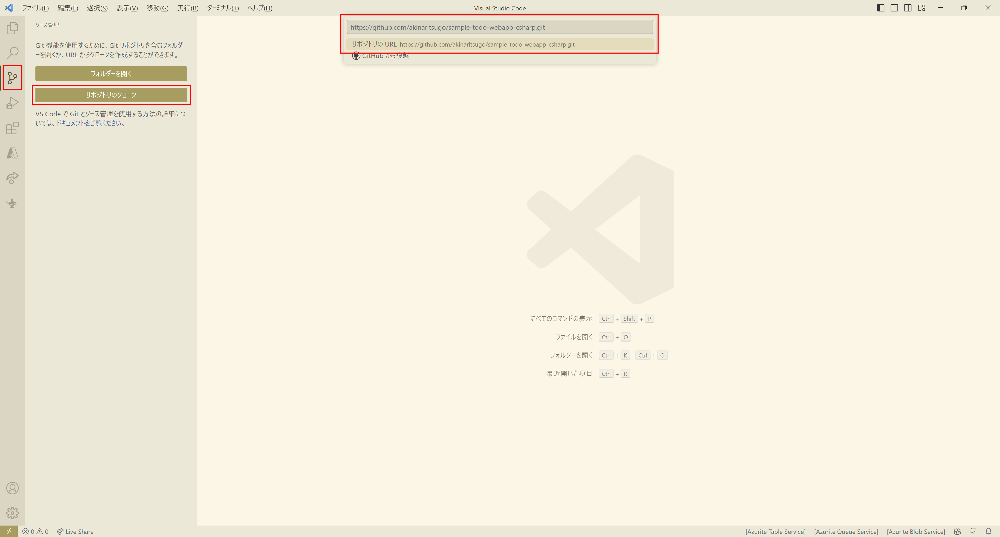

1. ローカルでテスト実行

    ```
    dotnet watch run
    ```

    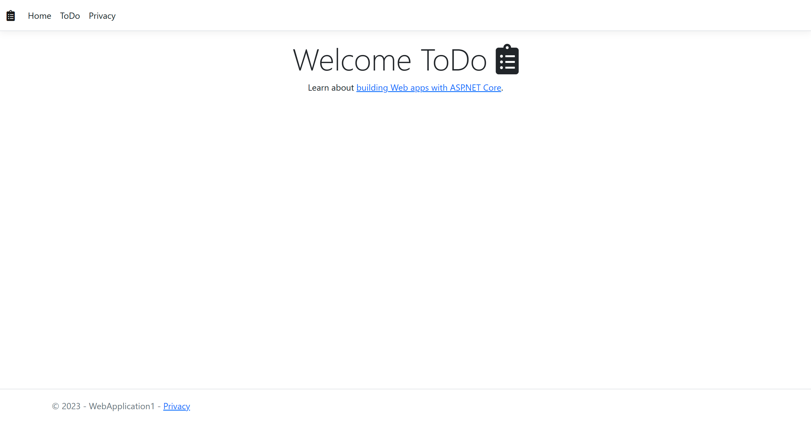

    (*1) 自動で `.sln` ファイルが作成された場合、削除して再度実行を試してください。

    (*2) まだDBと接続していないので「ToDo」タブへ移動してもエラーになります。

    (*3) 実行中アプリは `Ctrl + C` で停止できます。

## アプリケーションのデプロイ

(*) 開発環境上で実施

1. Visual Studio Code でリポジトリのクローンを開く

1. 左メニューの「Azure」アイコンを選択、
  「Sign in to Azure」を選択してAzureにサインイン

    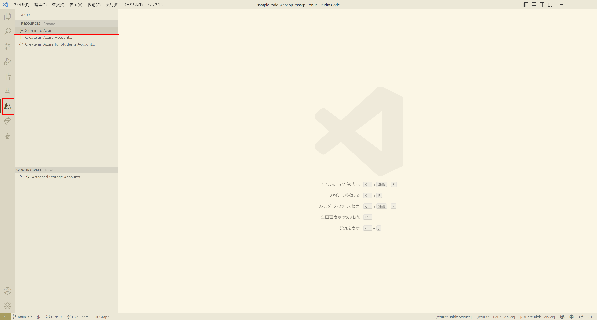

1. サブスクリプション、App Services を展開して 作成済 の App Service を右クリック、「Deploy to Web App」を選択

    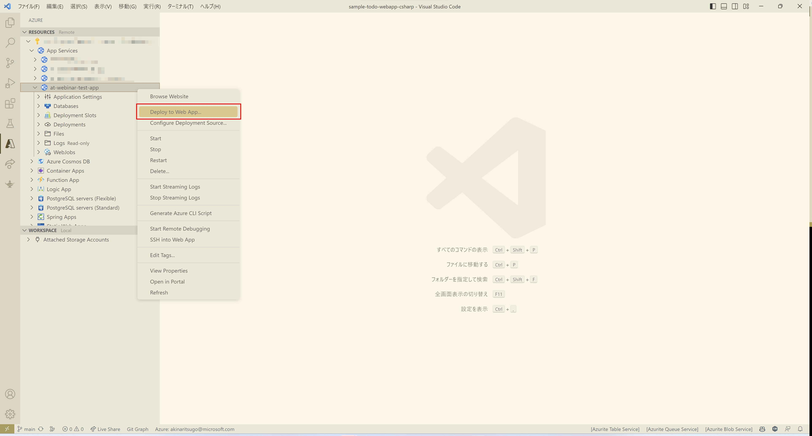

1. デプロイする対象のフォルダ選択がでるので `sample-todo-webapp-csharp` を選択

    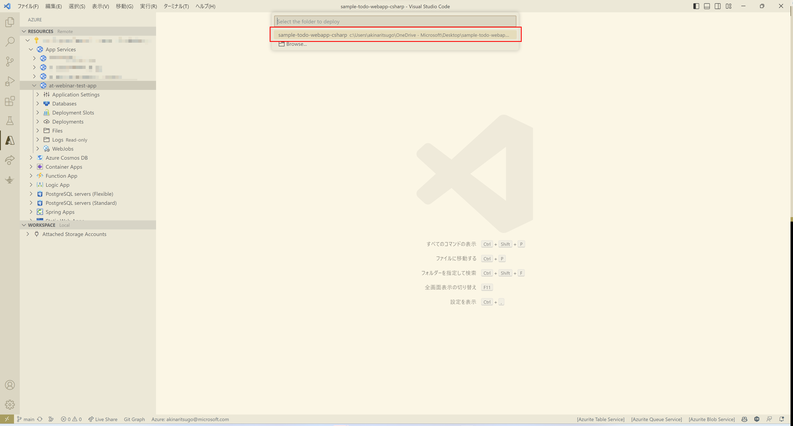

1. デプロイ完了メッセージが出るまで待つ


## App Service の設定

(*) Azureポータル上で実施

1. 作成済の SQL データベース を開き、[設定]-[接続文字列] を開く

    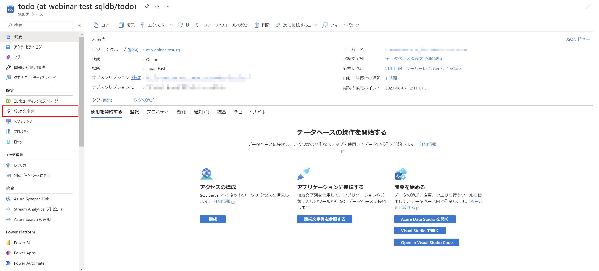

1. 「ADO.NET」にある接続文字列（SQL認証）をメモしておく

    接続文字列中にある `{your_password}` を正しい値に修正しておく

    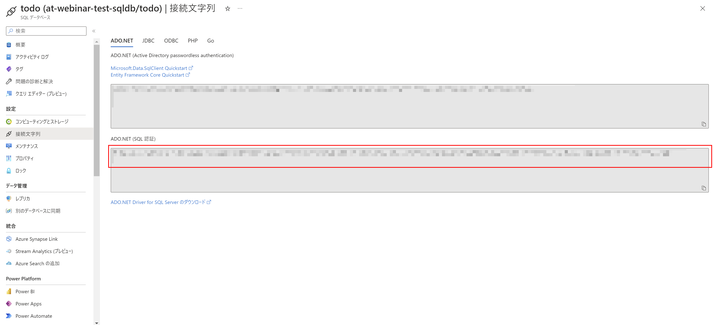

1. 作成済の App Service を開き、[設定]-[構成] を開く

    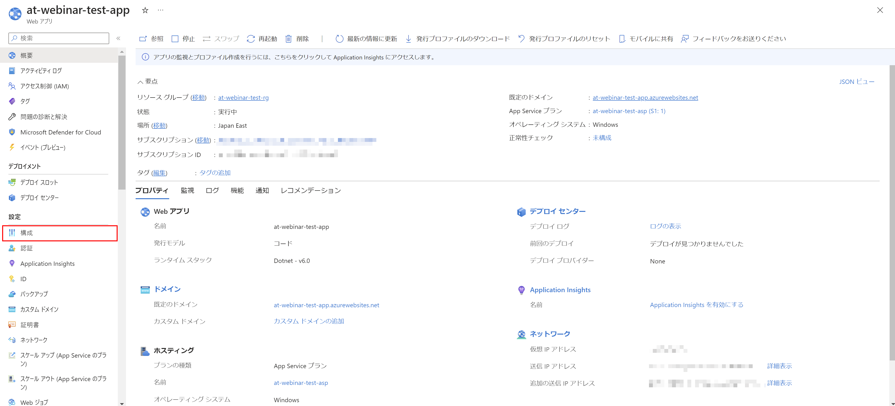

1. `Connection strings` に以下を追加して、「Save」

    | Name | Value | Type |
    |---|---|---|
    | `MSSQLDB` | (SQLデータベースで取得した接続文字列) | `SQLServer` |

    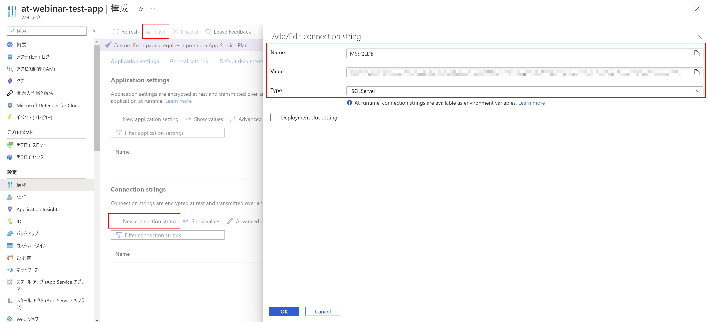

1. [概要]へ戻って「再起動」

    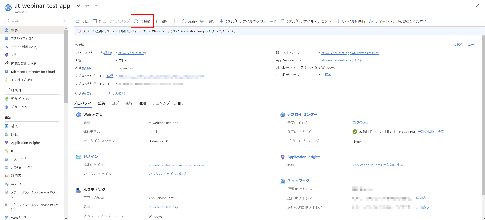


## アプリケーションの動作確認

(*) Azureポータル上で実施

1. Azure ポータルで作成済みの App Service を開き、 URL を確認

    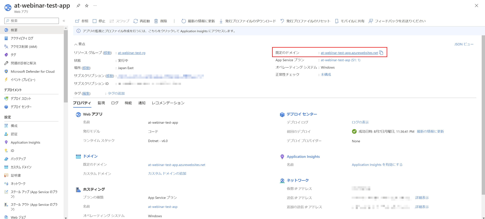

1. 別ブラウザで開いてアプリが動作していることを確認

    

1. 「ToDo」タブを開き、「新規タスク作成」を開く

    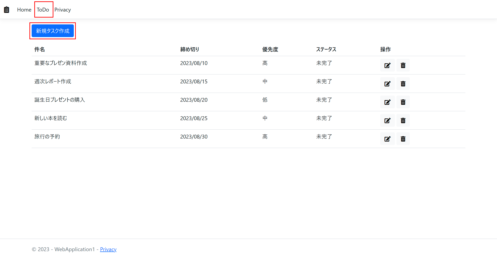

1. 適当な値を入力して「登録」

    * Description: (任意)
    * Created Date: (任意)

    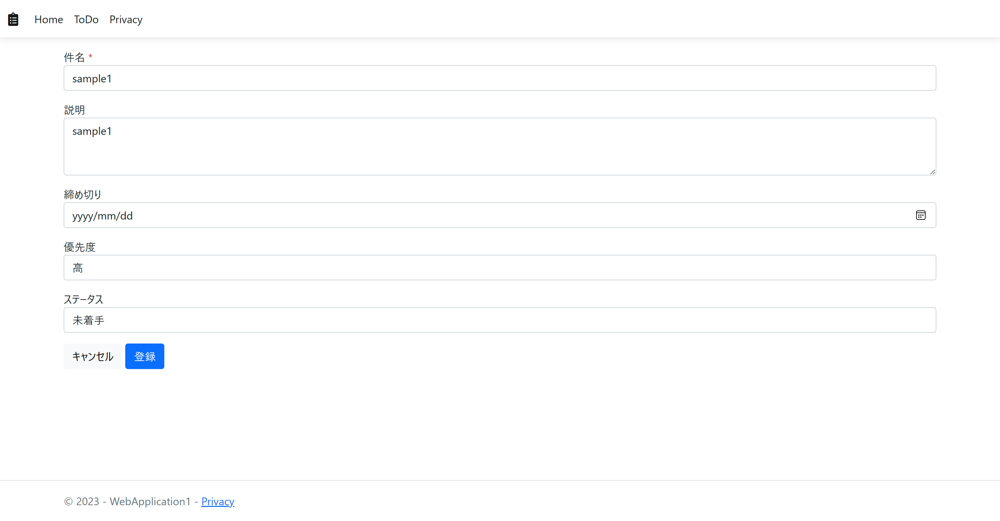

1. 新規にレコードが追加されたことを確認

    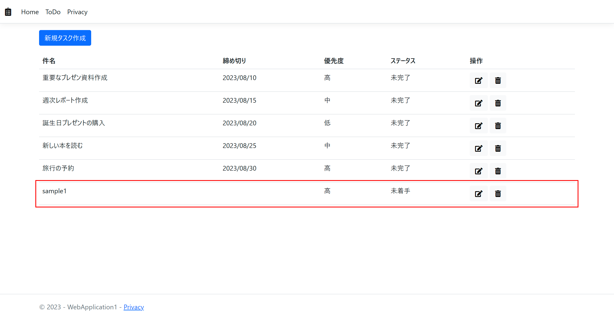


## SQL Database へデータ登録されたことを確認

(*) Azureポータル上で実施

1. Azureポータルで作成済みの SQL Database を開き、「クエリエディター」を開く

    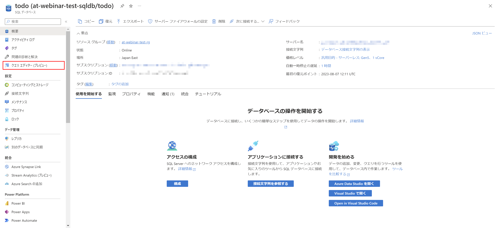

1. サインインを実行して、以下のクエリを実行、
    登録したデータが存在することを確認

    ```
    select * from [dbo].[Tasks];
    ```

    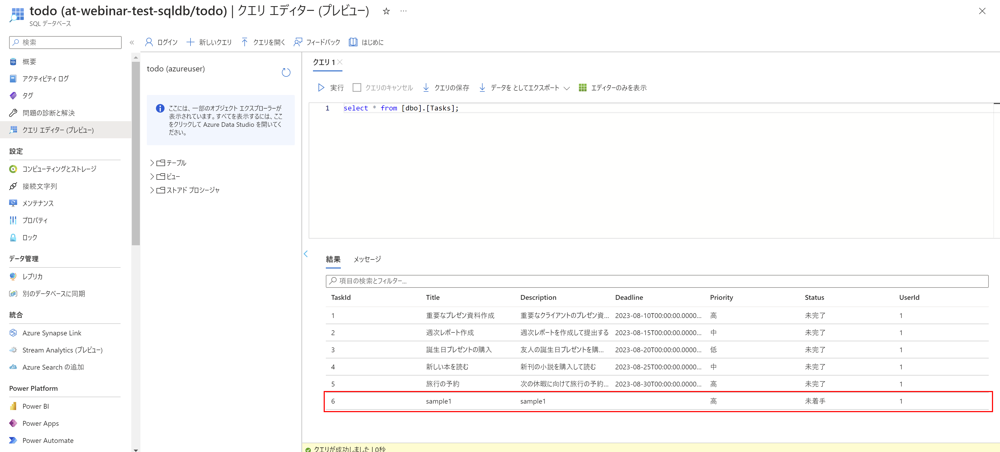


# 次の Exercise へ

* [環境削除](exercise99.md)

